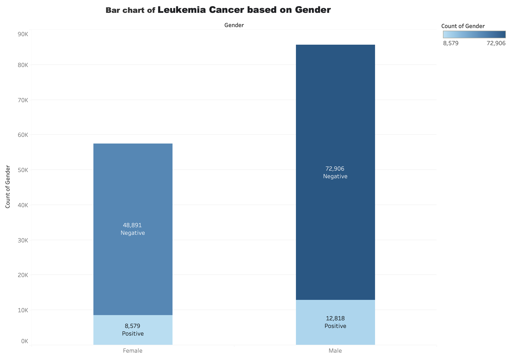
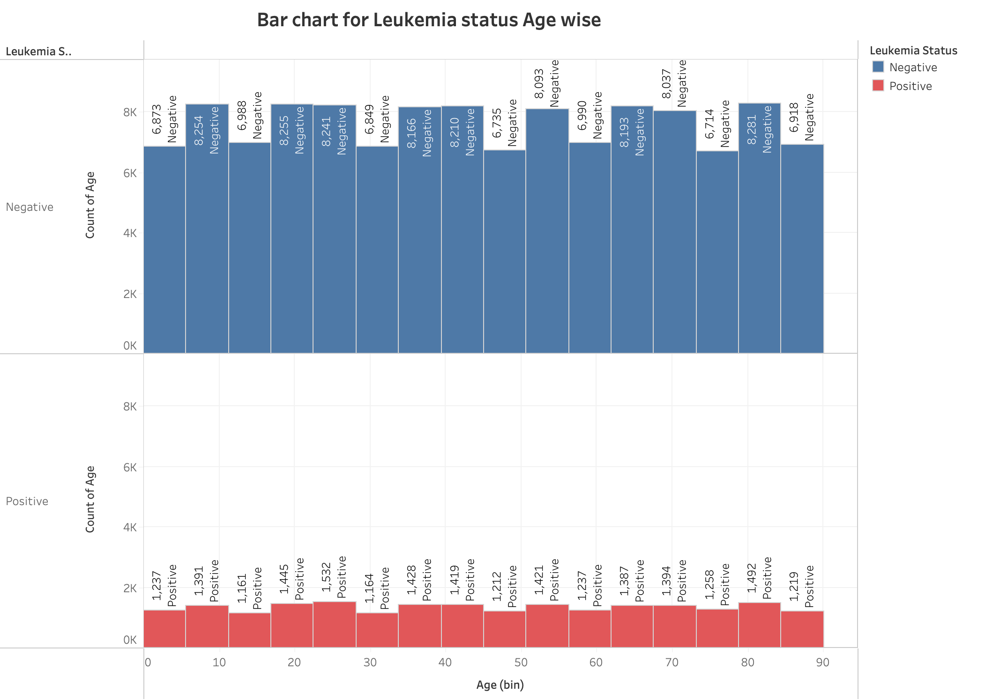
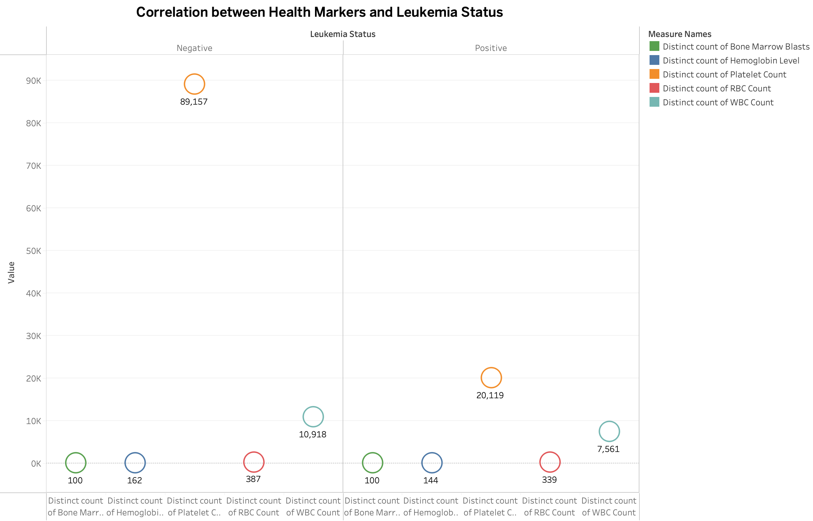
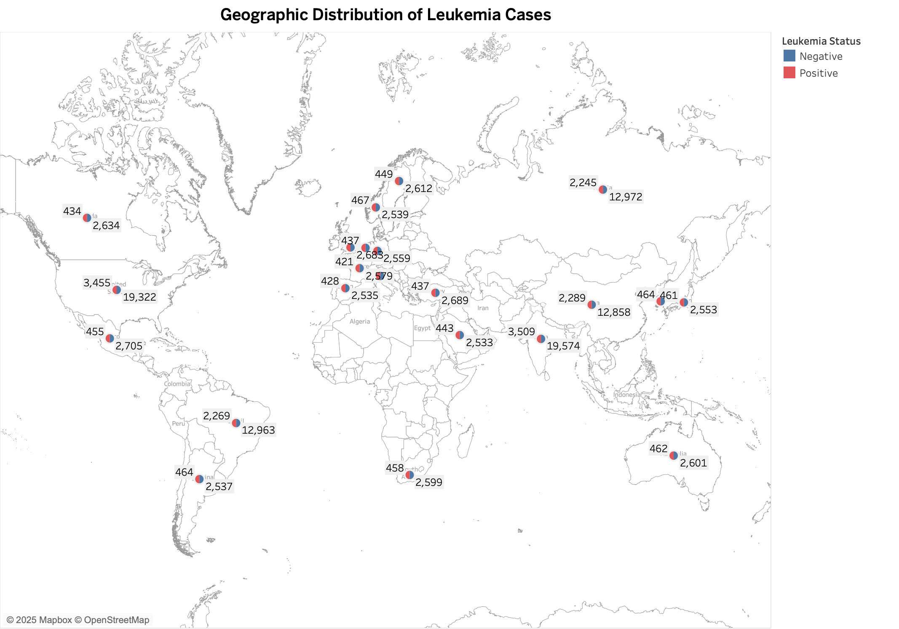
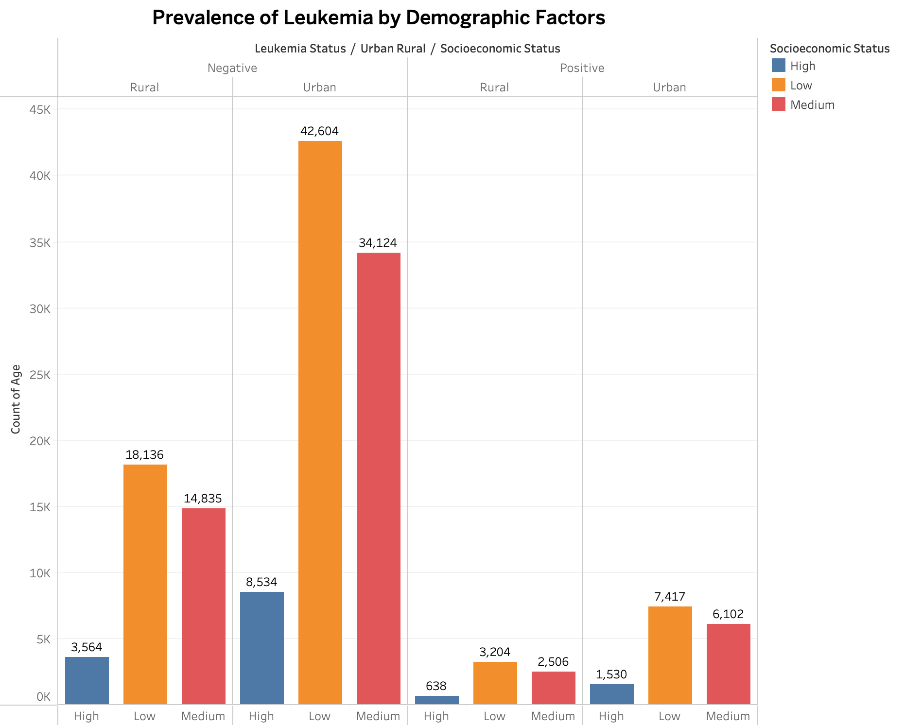
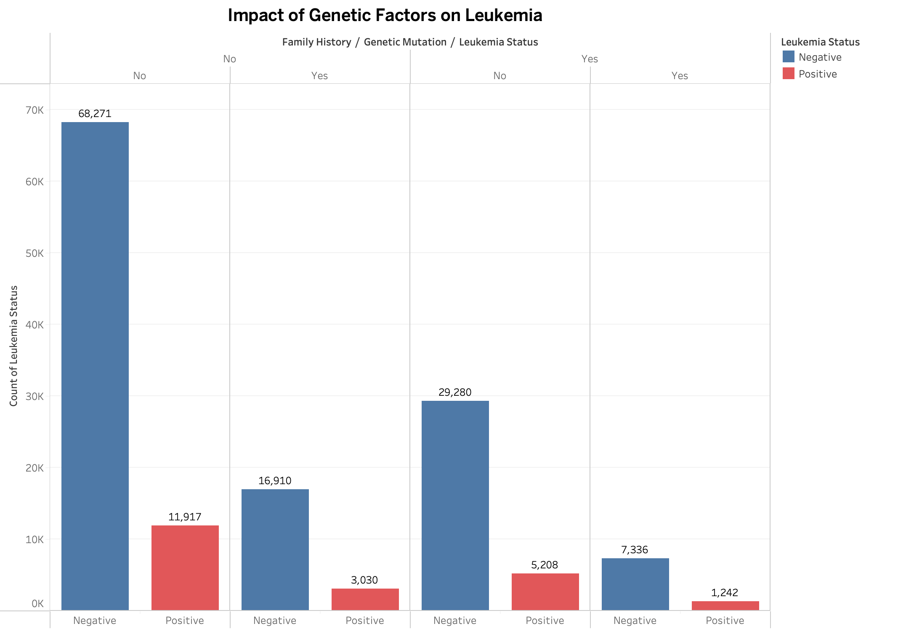
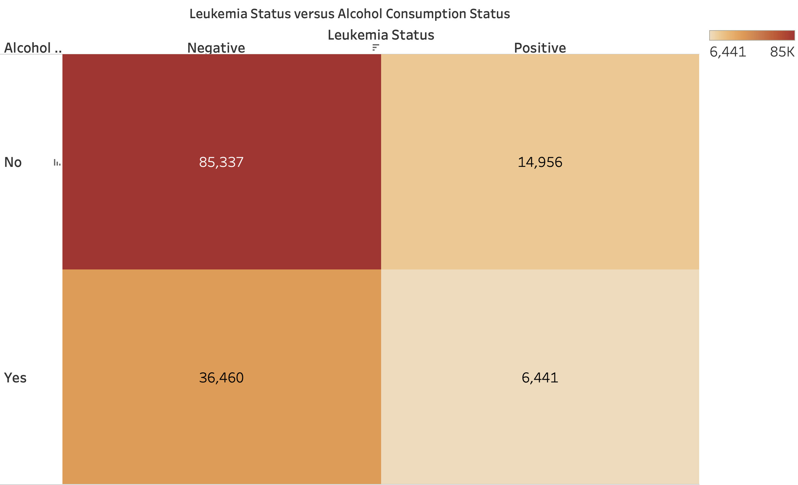
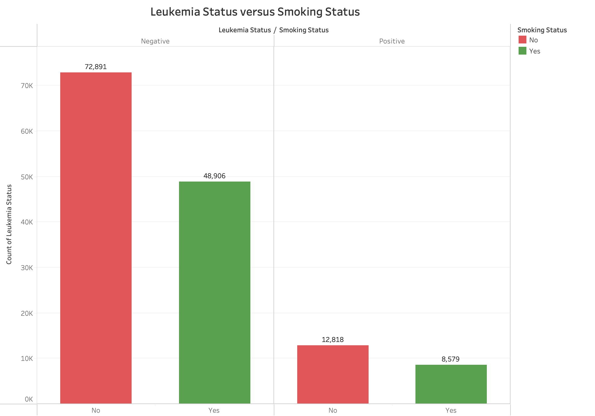
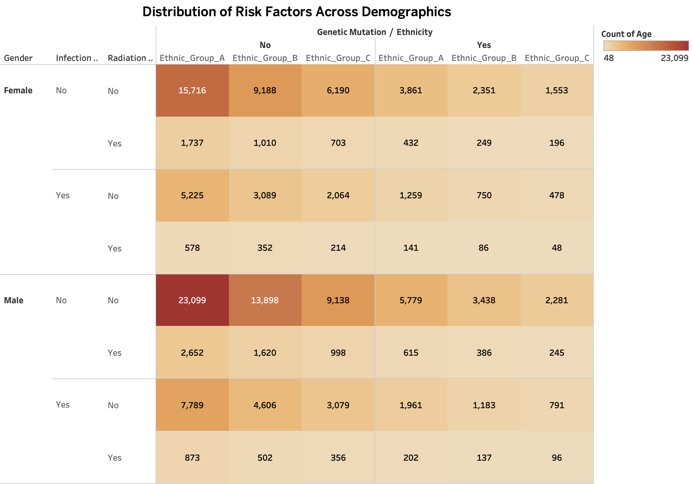

# Leukemia Cancer Risk Prediction Dataset Visualization

This project explores the Leukemia Cancer Risk Prediction Dataset, visualizing its characteristics and highlighting potential biases within the data.  Understanding these biases is crucial for developing fair and accurate predictive models for leukemia risk.

## Introduction to the Dataset

The dataset contains 143,194 patient records, offering a substantial amount of data for analysis.  The data spans across 22 diverse countries, allowing for the examination of potential geographic variations in leukemia prevalence and related factors.

## Key Features

The dataset includes various features potentially relevant to leukemia risk prediction, they likely include:

*   **Patient_ID:** A unique identifier for each patient.
*   **Age:** Age of the patient.
*   **Gender:** Gender of the patient.
*   **Country:** Country of residence.
*   **WBC_Count:** White blood cell count.
*   **RBC_Count:** Red blood cell count.
*   **Platelet_Count:** Platelet count.
*   **Hemoglobin_Level:** Hemoglobin level.
*   **Bone_Marrow_Blasts:** Percentage of blasts (immature blood cells) in the bone marrow.
*   **Genetic_Mutation:** Presence or absence of specific genetic mutations.
*   **Family_History:** Family history of leukemia.
*   **Smoking_Status:** Smoking status of the patient.
*   **Alcohol_Consumption:** Alcohol consumption habits.
*   **Radiation_Exposure:** History of radiation exposure.
*   **Infection_History:** History of infections.
*   **BMI:** Body mass index.
*   **Chronic_Illness:** Presence of chronic illnesses.
*   **Immune_Disorders:** History of immune disorders.
*   **Ethnicity:** Ethnicity of the patient.
*   **Socioeconomic_Status:** Socioeconomic status of the patient.
*   **Urban_Rural:** Whether the patient resides in an urban or rural area.
*   **Leukemia_Status:** Leukemia diagnosis status (e.g., positive, negative).  This is the target variable.

## Tools Used: Tableau
## Project Goals

This visualization project aims to:
*   Visualize the distribution of key features
*   Highlight existing biases
*   Provide insights into potential relationships
*   Serve as a basis for further analysis

## Dataset Link

The original dataset can be found on Kaggle: [Leukemia Cancer Risk Prediction Dataset](https://www.kaggle.com/datasets/ankushpanday1/leukemia-cancer-risk-prediction-dataset/data)

## Visualizations

### Bar Chart of Leukemia Cases by Gender

*   This bar chart visualizes the distribution of leukemia cases across genders (Female and Male), broken down by Leukemia Status (Positive and Negative).  It shows the absolute counts for each combination.

*   **Females:**
    *   **Negative for Leukemia:** 48,891
    *   **Positive for Leukemia:** 8,579
*   **Males:**
    *   **Negative for Leukemia:** 72,906
    *   **Positive for Leukemia:** 12,818

### Leukemia Status by Age Group

 

*   This stacked bar chart visualizes the distribution of Leukemia Status (Positive and Negative) across different age group bins. Each bar represents an age group, and it is segmented to show the proportion of positive and negative leukemia cases within that group.

*   The chart suggests a potential trend of increasing negative leukemia cases with age, while positive cases appear to fluctuate less consistently. 

### Correlation Between Health Markers and Leukemia Status

*   This scatter plot shows the relationship between various health markers (Bone Marrow Blasts, Hemoglobin Level, Platelet Count, RBC Count, and WBC Count) and Leukemia Status (Negative and Positive). 

*   There appears to be a noticeable difference in the "Platelet Count" and "WBC Count" between the negative and positive leukemia groups.  

### Geographic Distribution of Leukemia Cases

 

*   This map visualizes the geographic distribution of leukemia cases across the 22 countries included in the dataset indicating Leukemia Status (Negative or Positive) and the numbers displaying the respective case counts.

*  India shows 19,574 negative cases and 3,509 positive cases. Another country, USA shows 19,322 negative and 3,455 positive cases.  

### Prevalence of Leukemia by Demographic Factors

  

* The data reveals a potential correlation between socioeconomic status, urban/rural location, and leukemia prevalence, with negative cases significantly outnumbering positive cases across all demographics, and the highest negative case count observed in urban areas with low socioeconomic status.

    *   **Negative Leukemia Status:**
        *   **Rural:**  High (3,564), Low (18,136), Medium (14,835)
        *   **Urban:** High (8,534), Low (42,604), Medium (34,124)
    *   **Positive Leukemia Status:**
        *   **Rural:** High (638), Low (3,204), Medium (2,506)
        *   **Urban:** High (1,530), Low (7,417), Medium (6,102)

### Impact of Genetic Factors on Leukemia

 

*   The chart compares four groups based on the presence or absence of these genetic factors, showing the count of individuals in each group who tested positive or negative for leukemia.

*   Here's a breakdown of the data:

    *   **No Family History, No Genetic Mutation:**
        *   Negative Leukemia Status: 68,271
        *   Positive Leukemia Status: 11,917
    *   **No Family History, Genetic Mutation:**
        *   Negative Leukemia Status: 16,910
        *   Positive Leukemia Status: 3,030
    *   **Family History, No Genetic Mutation:**
        *   Negative Leukemia Status: 29,280
        *   Positive Leukemia Status: 5,208
    *   **Family History, Genetic Mutation:**
        *   Negative Leukemia Status: 7,336
        *   Positive Leukemia Status: 1,242

### Leukemia Status vs. Alcohol Consumption Status

 

*   This heatmap visualizes the relationship between Alcohol Consumption Status (Yes/No) and Leukemia Status (Negative/Positive). 

    *   **No Alcohol Consumption:**
        *   Negative Leukemia Status: 85,337
        *   Positive Leukemia Status: 14,956
    *   **Alcohol Consumption:**
        *   Negative Leukemia Status: 36,460
        *   Positive Leukemia Status: 6,441

    The heatmap clearly shows a much higher number of individuals who do not consume alcohol compared to those who do, across both negative and positive leukemia statuses. 

### Leukemia Status vs. Smoking Status

*   This grouped bar chart visualizes the relationship between Smoking Status (Yes/No) and Leukemia Status (Negative/Positive).  

    *   **Non-Smokers:**
        *   Negative Leukemia Status: 72,891
        *   Positive Leukemia Status: 12,818
    *   **Smokers:**
        *   Negative Leukemia Status: 48,906
        *   Positive Leukemia Status: 8,579

### Distribution of Risk Factors Across Demographics

*   This heatmap visualizes the distribution of several risk factors (Infection History, Radiation Exposure, and Genetic Mutation) across different demographic groups (Gender and Ethnicity). The heatmap facilitates the exploration of these complex interactions and helps identify potential disparities in risk factor distribution across different demographic groups. 

## Conclusion

This visualization project explored the Leukemia Cancer Risk Prediction Dataset. Key findings include a gender imbalance in negative leukemia cases, potential correlations between socioeconomic status and leukemia prevalence, and variations in risk factor distribution across different demographic groups. 
